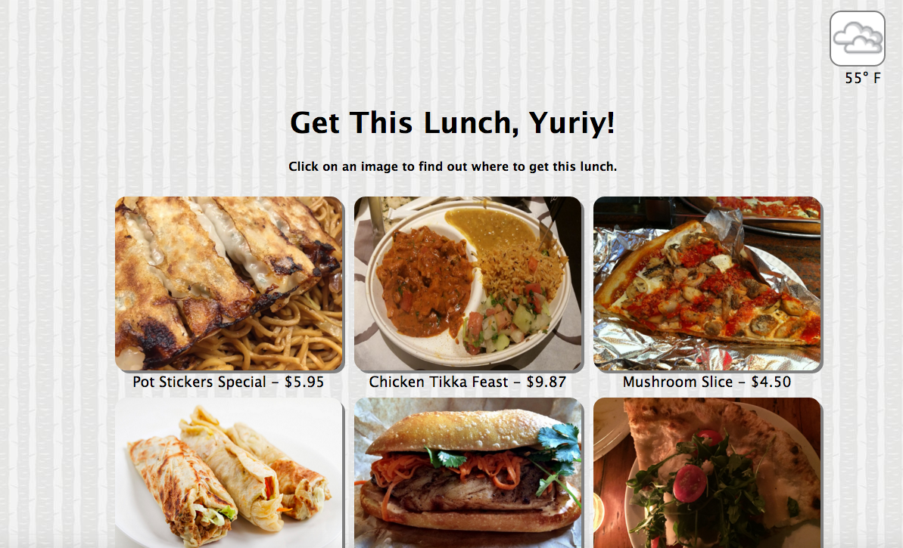

# Get This Lunch
## By [Yuriy Turetskiy](https://github.com/yuriyt2)

### Purpose
+ To help a user decide on what to eat for lunch by showing user-generated photos of food available in the Flatiron District.  

### Features
+ Users are required to create an account in order to access the application.
+ The app provides the current temperature and weather conditions in the 10012 area code.
+ A logged in user is presented with photos and price of all the food items posted to Get This Lunch in random order.
+ A user can add a food item and upload an image of it.
+ A user can click on a food item from the list to see more details about it.
+ A user can leave comments on the food item.
+ A user can delete only the food item he/she posted.

### Technology Used
+ Ruby on Rails
+ PostgreSQL
+ AWS S3
+ Paperclip
+ HTTParty
+ Accu-Weather API

### Deployment URL
[Get This Lunch](https://getthislunch.herokuapp.com/)

### Setup
To test the app out locally:

1. Clone the repository.
2. Run a Rails server from the app folder.
3. Run a Postres SQL server.
4. Create a user account and log in.
